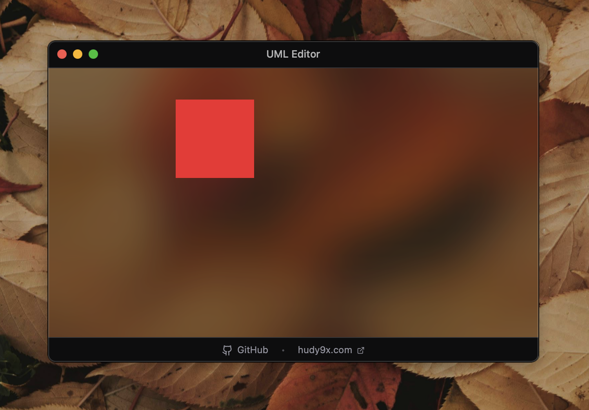

# Tauri Desktop App Template

A modern template for building cross-platform desktop applications using Tauri, React, and TypeScript. This template comes pre-configured with essential tools and commands to jumpstart your desktop app development.

## 💎 Feature Showcase: macOS Window Customization

This branch demonstrates a custom macOS window implementation with native blur, rounded corners, and shadow.

**What's implemented:**
- **Native Blur:** Uses `window-vibrancy` for high-performance frosted glass effects.
- **Custom Shape:** 10px rounded corners with hidden native titlebar.
- **Native Shadow:** Forced drop shadow via Cocoa APIs for borderless windows.
- **Transparency:** Fully transparent or tinted background support.

**How it works:**
1. Window is created programmatically in Rust with `.decorations(false)`.
2. `window-vibrancy` applies the `HudWindow` material with rounded corners.
3. Native Cocoa APIs (`setHasShadow:`) ensure the drop shadow is visible.
4. CSS handles the content clipping and optional color tinting.

📚 **Full implementation guide:** See [`docs/workflow-macos-window.md`](docs/workflow-macos-window.md) for implementation details.
