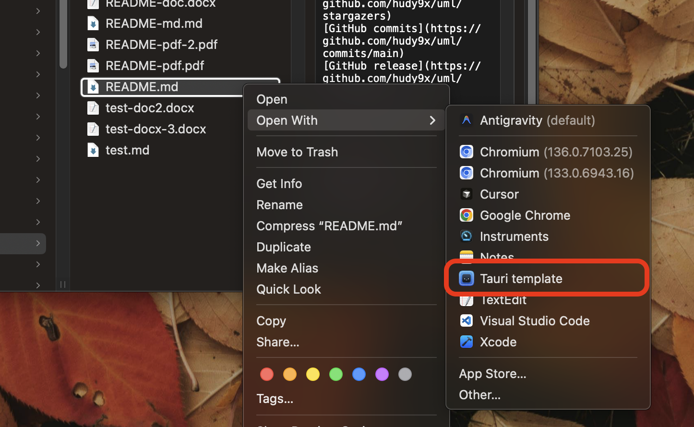

## � Feature Showcase: macOS "Open With" Implementation

This branch demonstrates a complete implementation of macOS "Open With" functionality, allowing users to open markdown files directly from Finder.

**What's implemented:**
- Right-click any `.md` file in Finder → "Open With" → Your App
- File opens in a dedicated viewer page with clean UI
- Automatic file path detection using Tauri Store plugin
- Retry logic for reliable file loading
- Clean navigation without redirect loops

**How it works:**
1. File associations configured in `tauri.conf.json` make the app appear in "Open With" menu
2. Backend captures file path via `RunEvent::Opened` and stores it using `tauri-plugin-store`
3. Frontend checks store with retry logic and navigates to `/open-with` page
4. File content displays with option to close and return home

📚 **Full implementation guide:** See [`docs/workflow-open-with.md`](docs/workflow-open-with.md) for step-by-step instructions.

## 📚 Full Template Documentation

For complete template documentation, setup instructions, and all features, see the [main branch README](https://github.com/hudy9x/template-tauri/tree/main).

This branch focuses specifically on demonstrating the "Open With" feature implementation.
